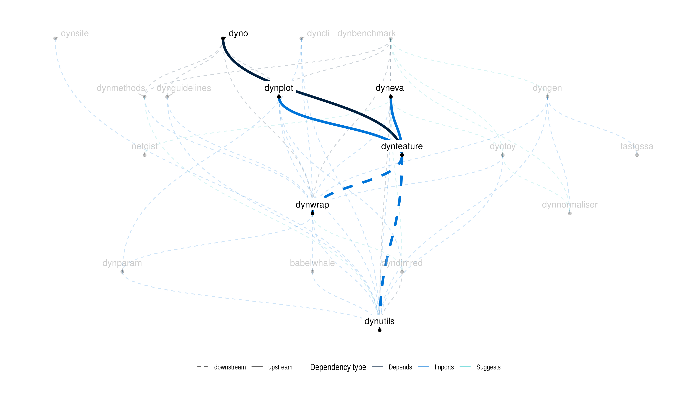

<!-- README.md is generated from README.Rmd. Please edit that file -->

```{r setup1, include=FALSE}
knitr::opts_chunk$set(fig.path=".readme_files/", warning=FALSE, message=FALSE, error=FALSE, echo = TRUE)
```

<a href="https://travis-ci.org/dynverse/dynfeature"></a> <a href="https://codecov.io/gh/dynverse/dynfeature"> </a>  [**ℹ️ Tutorials**](https://dynverse.org)

# Calculating differentially expressed features across a trajectory

Included are methods to

* Calculate the overall feature importance, using `calculate_overall_feature_importance`
* Calculate the importance of a feature at a bifurcation point, using `calculate_milestone_feature_importance`

The plotting of the top features is nicely intergrated into [dynplot](https://github.com/dynverse/dynplot)

[](https://github.com/dynverse/dynplot)

## Latest changes

Check out `news(package = "dynwrap")` or [NEWS.md](NEWS.md) for a full list of changes.

<!-- This section gets automatically generated from NEWS.md -->

```{r news, echo=FALSE, results="asis"}
cat(dynutils::recent_news())
```

## Dynverse dependencies

<!-- Generated by "update_dependency_graphs.R" in the main dynverse repo -->

