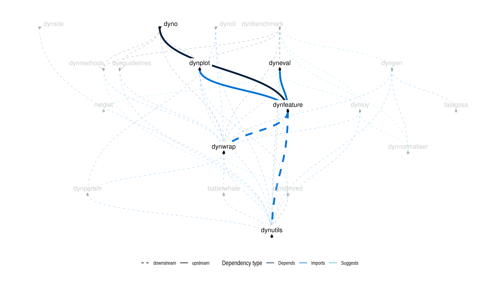

<!-- README.md is generated from README.Rmd. Please edit that file -->
<!-- badges: start -->

[**Tutorials**](https://dynverse.org) <!-- badges: end -->

# Calculating differentially expressed features across a trajectory

Included are methods to

-   Calculate the overall feature importance, using
    `calculate_overall_feature_importance`
-   Calculate the importance of a feature at a bifurcation point, using
    `calculate_milestone_feature_importance`

The plotting of the top features is nicely intergrated into
[dynplot](https://github.com/dynverse/dynplot)

## Latest changes

Check out `news(package = "dynwrap")` or [NEWS.md](NEWS.md) for a full
list of changes.

<!-- This section gets automatically generated from NEWS.md -->

### Recent changes in dynfeature 1.0.1

-   MINOR CHANGE: Fixes to the description.

### Recent changes in dynfeature 1.0.0

Initial release of dynfeature on CRAN.

-   MINOR CHANGE: Use only one core by default.

-   MINOR CHANGE: Support sparse matrices.

-   DOCUMENTATION: Add examples and returns.

## Dynverse dependencies

<!-- Generated by "update_dependency_graphs.R" in the main dynverse repo -->

